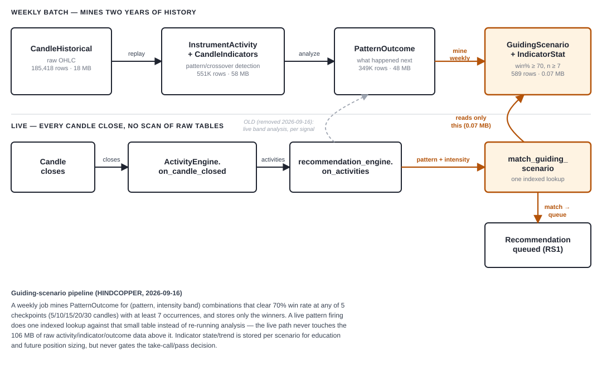

# Guiding Scenarios — Recommendation Pipeline

Last updated: 2026-09-16

## What this is

The mechanism behind RS1 (the live-trading recommendation system): instead of
re-analyzing raw pattern history every time a live signal fires, a **weekly batch
job** mines historical outcomes into a small table of proven-winning
`(pattern, intensity band)` combinations, and the **live path** does one cheap,
indexed lookup against that table. This replaced an earlier design (RS1/RS2/RS3,
built 2026-09-15) that queried raw `PatternOutcome` data live, per signal.



## The pipeline, stage by stage

### 1. Historical data fetch (one-time / as-needed)

`historical_data_service.ensure_data_available` pulls raw OHLC candles from the
broker into `CandleHistorical` — the one table in this whole pipeline that is
**not** derived from anything else. Broker history has real retention limits, so
this is the closest thing to a source of truth the system has.

### 2. Replay through `ActivityEngine` (one-time / as-needed)

Every candle is replayed through `activity_engine.ActivityEngine.on_candle_closed`,
which detects candlestick patterns, indicator crossovers, structure shifts, and
graph formations, writing:

- `InstrumentActivity` — one row per detected occurrence (pattern name, timeframe,
  timestamp, intensity, OHLC at detection)
- `CandleIndicators` — RSI/MACD/Stochastic/VWAP/MA/ATR/Bollinger Band snapshots for
  every candle

### 3. Outcome analysis (one-time / as-needed)

`pattern_outcome_analysis.analyze_instrument` walks every detected activity and
records what actually happened afterward — a neutral, un-opinionated measurement,
independent of any predicted stop-loss/target:

- `PatternOutcome` — % price change at 5/10/15/20/30 candles after detection, plus
  max favorable/adverse move, plus the RSI/MACD/Stochastic value+state+trend at the
  moment the pattern fired

This step is gap-aware (`_truncate_at_data_gap`) so a real data-collection hole
never gets treated as "the next candle."

### 4. Guiding-scenario generation — **the weekly batch job**

`guiding_scenarios.generate_guiding_scenarios` is the core of this design. For one
instrument/timeframe/lookback-window at a time, it:

1. Loads all `PatternOutcome` rows once via `LibPatternOutcomes.InstrumentHistoryCache`
   (2 queries total, not one per pattern).
2. For every pattern, splits occurrences into equal-count intensity bands (terciles
   by default).
3. For each band, checks **all 5 checkpoints** (5/10/15/20/30 candles) — not just
   one fixed checkpoint — and keeps whichever qualifying checkpoint scores highest.
   A band that misses the bar at 20 candles but clears it at 5 is not discarded.
4. Keeps a band only if it clears **win% &ge; 70% and sample size &ge; 7**, scored
   by Wilson-score lower bound (accounts for sample size, not just raw win rate).
5. **Replaces** (delete + bulk-insert) the instrument/timeframe/window's whole
   `GuidingScenario` set with exactly the qualifying bands — the qualifying set can
   genuinely change week to week, so this is a clean re-derivation, not a diff.
6. For each qualifying band, also computes a `GuidingScenarioIndicatorStat`
   breakdown — RSI/MACD/Stochastic state/trend win rates **scoped to that band's own
   occurrence subset**, for education and future volume/SL-target sizing. This data
   is stored but **never gates** the live decision.

Two independent lookback windows are generated and stored separately —
`"2y"` (730 days) and `"3m"` (90 days) — with no combination rule decided yet; a
future live-wiring decision can require both, consult either, or treat one as
primary.

**No scheduler is wired up.** This matches the project's established convention
(see `feed/gap_fill.py`'s design philosophy): a plain, idempotent, manually-callable
function, not standing infrastructure. `backend/scripts/generate_guiding_scenarios.py`
is the entry point:

```
.venv/Scripts/python.exe backend/scripts/generate_guiding_scenarios.py [SYMBOL ...]
```

Running it weekly is a manual or external-scheduler decision (cron / Windows Task
Scheduler), not yet automated.

### 5. Live lookup — every candle close

`app.py`'s `_make_on_candle_closed` calls `recommendation_engine.on_activities`
with whatever `ActivityEngine.on_candle_closed` just detected — the first real live
consumer of that return value (previously only offline scripts used it). For each
activity with a pattern and an intensity value:

1. `guiding_scenarios.match_guiding_scenario` does **one indexed query** against the
   small `GuidingScenario` table (instrument + timeframe + pattern + window_kind +
   intensity falling inside a stored band). No fallback to the nearest band — a
   precomputed scenario is a specific, already-decided claim, not something to
   stretch to fit.
2. A match writes a `Recommendation` row (`status="queued"`), copying the band's
   win%/sample_count/wilson_score, and recording which `GuidingScenario` row and
   window justified it.
3. No match means no row at all — a clean, fast "pass," not an error and not a
   persisted rejection (there is nothing left to reject: a non-qualifying band was
   never written to `GuidingScenario` in the first place).

Wrapped in `try/except` so a lookup failure can never break the live candle-close
path.

### 6. The recommendation queue

`Recommendation` rows go through the existing queue lifecycle (`LibRecommendations`):
`queued` &rarr; `selected` (`mark_selected`, a deliberate caller-invoked step — nothing
places a broker order automatically) or `expired` (`sweep_expired`, past
`expires_at`) &rarr; optionally regenerated (`sweep_and_regenerate`, re-runs the lookup
against fresh guiding-scenario data, capped by `recommendation_max_regenerations`).

## Key design decisions

- **Decision gate = pattern + intensity band only.** Indicator state/trend is
  computed and stored but never gates the take-call/pass decision — no live
  confirmation/veto step exists. A real scenario can (and does) contain an
  indicator sub-band at 0% win rate sitting right alongside an otherwise-queued
  70%+ scenario.
- **RS2 and RS3 are removed.** Only RS1 remains, its mechanism changed from live
  analysis to the precomputed lookup above. Confirmed via research before removal:
  neither RS2 nor RS3 was ever wired into a live poller, so removal had zero
  runtime blast radius.
- **All 5 checkpoints are searched, not one fixed checkpoint**, and the
  sample-size floor is 7, not 10 — both changed 2026-09-16 after the first real run
  against HINDCOPPER only found 8 qualifying scenarios total.
- **Delete-and-reinsert regeneration**, not incremental diffing — matches the
  "clean re-fetch over patch" approach already used for historical data-quality
  fixes.

## Real numbers (HINDCOPPER, 2026-09-16)

| Stage | Rows | Size |
|---|---|---|
| `CandleHistorical` | 185,418 | 18.4 MB |
| `InstrumentActivity` + `CandleIndicators` | 551K | 58.3 MB |
| `PatternOutcome` | 348,753 | 48.4 MB |
| `GuidingScenario` + `GuidingScenarioIndicatorStat` | 589 | 0.07 MB |

36 guiding scenarios total (18 per window). The live path only ever touches the
last row of that table — roughly a 500&times; smaller footprint than the raw
analysis data it's derived from, and a decision that used to require live database
analysis now costs one indexed lookup.

## Where things live

| Concern | File |
|---|---|
| Historical fetch | `backend/historical_data_service.py` |
| Pattern/crossover detection | `backend/activity_engine.py` |
| Outcome analysis | `backend/pattern_outcome_analysis.py` |
| Guiding-scenario generation + live lookup | `backend/guiding_scenarios.py` |
| Weekly generation entry point | `backend/scripts/generate_guiding_scenarios.py` |
| RS1 / recommendation queue | `backend/recommendation_engine.py` |
| Queue operations | `backend/db/ops/LibRecommendations.py` |
| Schema | `backend/db/models.py` — `GuidingScenario`, `GuidingScenarioIndicatorStat`,
  `Recommendation`, `RecommendationSystem` |
| Live wiring | `backend/app.py` — `_make_on_candle_closed` |

## Not built yet

- **No scheduler** for the weekly regeneration — manual or external cron only.
- **No volume/SL-target sizing formula** — `GuidingScenarioIndicatorStat` data is
  laid down for this but not consumed yet.
- **No window-combination rule** — `"2y"` and `"3m"` are generated and queryable
  independently; nothing yet decides how a live caller should combine them.
- **No real broker order placement** — this is still purely a recommendation queue.
- **No pruning of raw data** — `InstrumentActivity`/`CandleIndicators`/`PatternOutcome`
  are, in principle, fully derivable from `CandleHistorical` again at any time, so
  they could be pruned once `GuidingScenario` covers an instrument. Deliberately
  deferred until disk space is an actual constraint — see project memory
  `derived_data_pruning_plan` for the real trade-offs (two live features currently
  read `PatternOutcome` directly, and full regeneration measured ~30 minutes for
  one fully-populated instrument).
